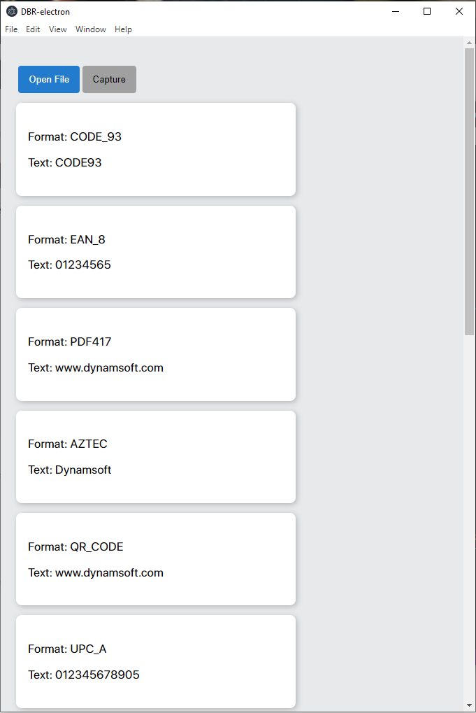
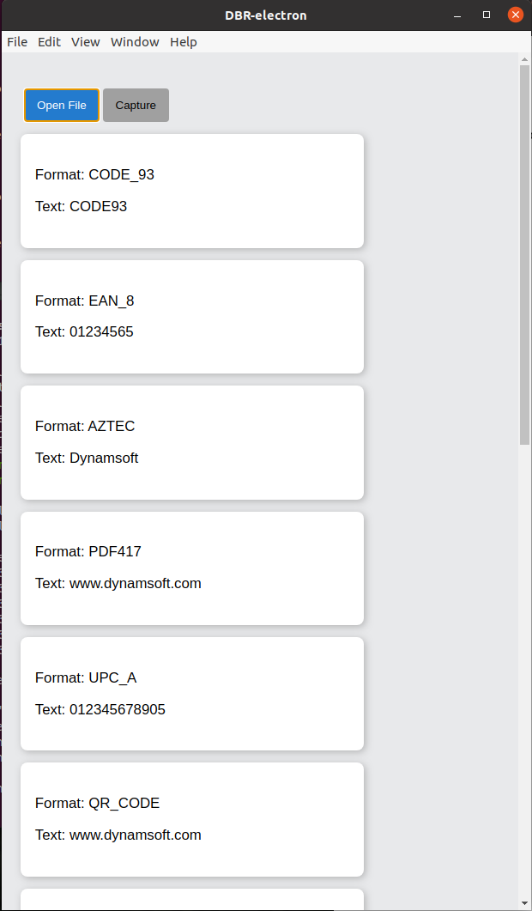

# Dynamsoft Barcode Reader with Electron

## Introduction

Dynamsoft Barcode Reader with Electron (dbr-electron) is a cross-platform barcode reader application built with Electron.

Dynamic Barcode Reader is an 1D & 2D barcode decoding SDKs for web, desktop (Windows, macOS, Linux) and mobile (iOS, Android). It has industry-leading performance and professional technicians supports. For more details, refer [Dynamic Barcode Reader - Homepage](https://www.dynamsoft.com/Products/Dynamic-Barcode-Reader.aspx). You can get 30-day trial license to evaluate the SDK from [here](https://www.dynamsoft.com/customer/license/trialLicense).

## Environment

```
electron: 10.1.3
Dynamsoft Barcode Reader: 7.6.0
```

Besides, a **C++ compiler** (GCC or others) is required. The **node-gyp** is required.

> For developers from mainland China, try to specify the registry to taobao mirror [https://registry.npm.taobao.org](https://registry.npm.taobao.org) if encountered any slow connection issue.

## Installation

### Install packages

Run `npm install` from the project root directory. It would install all the dependencies, including electron.

### Build the Dynamsoft Barcode Reader

Linux & macOS:

```bash
cd libs/nodejs-barcode
../../node_modules/.bin/electron-rebuild
```

Windows:

```cmd
cd .\libs\nodejs-barcode
..\..\node_modules\.bin\electron-rebuild
```

## Launching

```bash
npm start
```





## Related Articles

**Work In Progress**